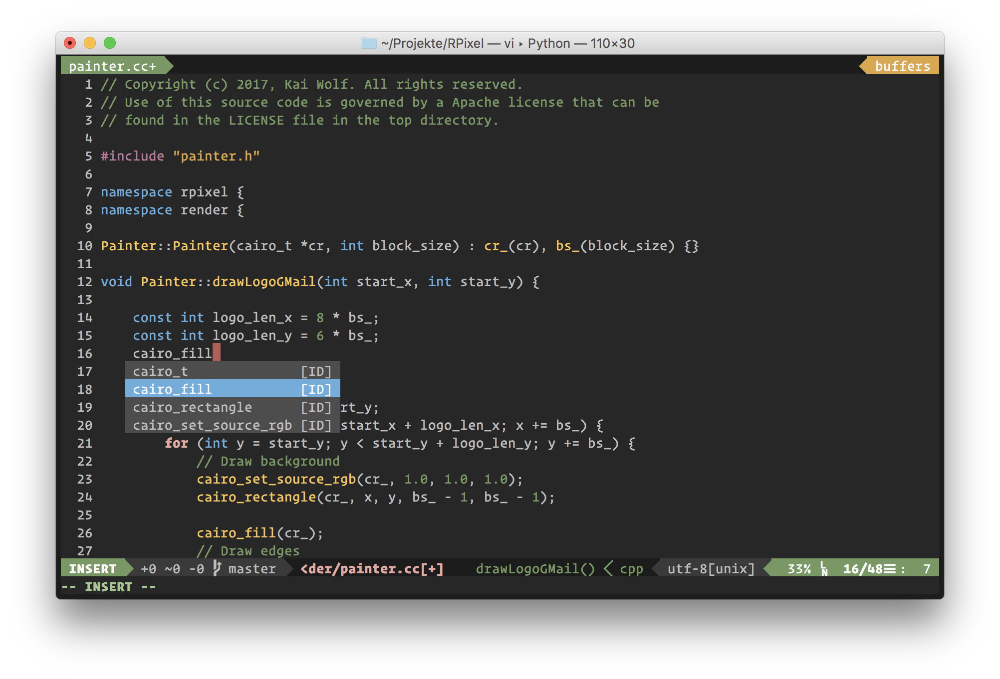
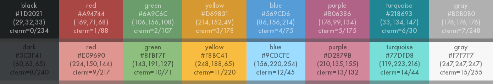

# NewProggie Color Scheme

This repository consists of a color scheme suitable for various editors.
The colors and contrasts are carefully chosen.

## Terminal Screenshot

## Color Palette

## Installation

    $ mkdir -p ${HOME}/.vim/colors
    $ mkdir -p ${HOME}/.vim/bundle/vim-airline-themes/autoload/airline/themes/
    $ wget https://raw.githubusercontent.com/NewProggie/NewProggie-Color-Scheme/master/colors/newproggie.vim -O ${HOME}/.vim/colors/newproggie.vim
    $ wget https://raw.githubusercontent.com/NewProggie/NewProggie-Color-Scheme/master/vim-airline-themes/newproggie.vim -O ${HOME}/.vim/bundle/vim-airline-themes/autoload/airline/themes/newproggie.vim
